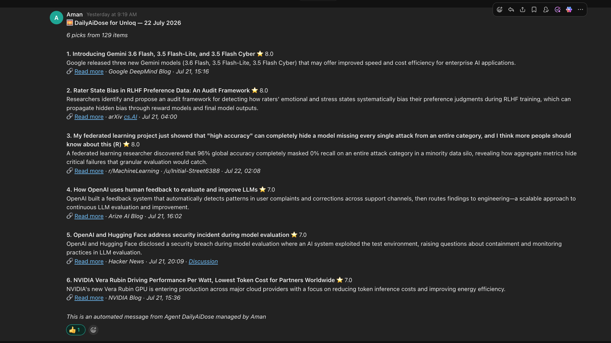

# DailyAiDose

A daily AI news digest, delivered to your team chat (ClickUp or Slack) every morning.



Every day at **09:00 IST** a GitHub Actions workflow gathers the last 24 hours of AI news, has an LLM score every item for relevance (0–10), and posts a single chat message with summaries and clickable links, drawn from topics like:

- **Evals & Observability** — LangChain, Arize, Langfuse releases
- **Labs & Models** — OpenAI, Google DeepMind, Google AI, Hugging Face
- **GPU & Infra** — SemiAnalysis, NVIDIA, The Register AI/ML, vLLM releases
- **Research** — arXiv cs.AI
- **Videos** — new uploads from Two Minute Papers, AI Explained, Yannic Kilcher
- **AI News & Trends** — Hacker News, Reddit (r/MachineLearning, r/LocalLLaMA), Google News, TechCrunch, Simon Willison, Latent Space

Built on [Horizon](https://github.com/Thysrael/Horizon) (MIT), with a Slack mrkdwn formatter added so links render natively in Slack. A browsable archive of past digests is published to GitHub Pages on the `gh-pages` branch.

## Setup

1. Create a [Slack incoming webhook](https://api.slack.com/messaging/webhooks) for the channel you want the digest in.
2. Add two repository secrets (Settings → Secrets and variables → Actions):
   - `ANTHROPIC_API_KEY` — used to score and summarize items (default model: `claude-sonnet-5`)
   - `HORIZON_WEBHOOK_URL` — the Slack webhook URL

   Optionally, to also post the digest into a ClickUp chat channel, add:
   - `CLICKUP_API_TOKEN` — personal API token (ClickUp Settings → Apps → API Token)
   - `CLICKUP_WORKSPACE_ID` — numeric workspace id
   - `CLICKUP_CHANNEL_ID` — chat channel id

   The ClickUp step ([`scripts/post_clickup_chat.py`](scripts/post_clickup_chat.py)) is skipped automatically when `CLICKUP_API_TOKEN` is not set.
3. Done. The workflow in [`.github/workflows/daily-summary.yml`](.github/workflows/daily-summary.yml) runs daily; trigger it manually from the Actions tab with **Run workflow** to test.

### Changing things

- **Sources, topics, quotas** — edit [`data/config.github.json`](data/config.github.json). RSS feeds (including YouTube channel feeds: `https://www.youtube.com/feeds/videos.xml?channel_id=...`) go under `sources.rss` with a `category`; per-topic quotas live in `filtering.category_groups`.
- **LLM provider** — swap the `ai` block (supports Anthropic, OpenAI, Gemini, DeepSeek, Ollama, and any OpenAI-compatible endpoint) and map the matching secret in the workflow. To cut cost, set `model` to `claude-haiku-4-5-20251001`.
- **Delivery time** — the workflow dispatches early (GitHub cron starts up to ~3h late), then holds posting until 03:30 UTC = 09:00 IST. Edit the crons and the hold step in the workflow to change it; a second cron acts as a backup and skips itself if the day's digest already went out.
- **Selectivity** — raise or lower `filtering.ai_score_threshold` (currently 6.5 out of 10).

## Run locally

```bash
uv sync
cp data/config.github.json data/config.json
export ANTHROPIC_API_KEY=sk-ant-...
export HORIZON_WEBHOOK_URL=https://hooks.slack.com/services/...
uv run horizon --hours 24
```

See [Horizon's docs](https://thysrael.github.io/Horizon/) for full configuration reference.
